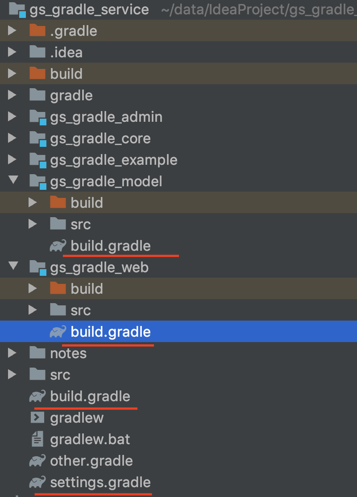

###### 项目构建图
```
Root project 'gs_gradle_service'
+--- Project ':gs_gradle_admin'
+--- Project ':gs_gradle_core'
+--- Project ':gs_gradle_model'
\--- Project ':gs_gradle_web'
```
###### 项目依赖关系
```
Root project 'gs_gradle_service'
+--- Project ':gs_gradle_admin'
        \--- Project ':gs_gradle_core'
            \--- Project ':gs_gradle_model'
+--- Project ':gs_gradle_core'
        \--- Project ':gs_gradle_model'
+--- Project ':gs_gradle_model'
\--- Project ':gs_gradle_web'
        \--- Project ':gs_gradle_core'
            \--- Project ':gs_gradle_model'
```
###### 项目目录

###### 项目配置
settings.gradle
```
rootProject.name = 'gs_gradle_service'
include 'gs_gradle_core', 'gs_gradle_model', 'gs_gradle_web', 'gs_gradle_admin'

```
root project build.gradle
* allprojects中的配置项对所有项目生效
* subprojects中的配置项仅对子项目生效
```
buildscript {

    ext {
        springBootVersion = '2.0.0.RELEASE'
    }

    repositories {
        mavenCentral()
    }

    dependencies {
        classpath("org.springframework.boot:spring-boot-gradle-plugin:${springBootVersion}")
    }
}

allprojects {
    group 'com.gsgradle.service'
    version '1.1-SNAPSHOT'
}

subprojects {
    apply plugin: 'java'
    apply plugin: "io.spring.dependency-management"


    sourceCompatibility = 1.8

    tasks.withType(JavaCompile) {
        options.encoding = "UTF-8"
    }
// java编译的时候缺省状态下会因为中文字符而失败
    [compileJava, compileTestJava, javadoc]*.options*.encoding = 'UTF-8'

    repositories {
        mavenLocal()
        maven { url 'http://maven.aliyun.com/nexus/content/groups/public/' }
        mavenCentral()
    }

    dependencies {
        implementation 'ch.qos.logback:logback-classic:1.2.2'
        testImplementation group: 'junit', name: 'junit', version: '4.12'
        compile 'org.springframework.boot:spring-boot-gradle-plugin:2.0.0.RELEASE'
    }
}

```
* gs_gradle_web build.gradle
```
plugins {
    id 'war'
}

dependencies {
    compile project(":gs_gradle_core")
}
```
* gs_gradle_admin build.gradle
```
plugins {
    id 'war'
}
dependencies {
    compile project(":gs_gradle_core")
}
```

* gs_gradle_core build.gradle
```
dependencies {
    compile project(":gs_gradle_model")
    testImplementation group: 'junit', name: 'junit', version: '4.12'
}
```

* gs_gradle_model build.gradle
```
```
