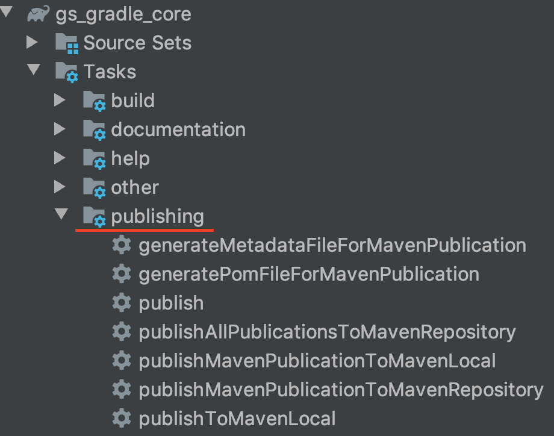

###### 脚本
build.gradle,使用maven-publish
```
apply plugin :'maven-publish'
publishing {
    publications {
        maven(MavenPublication) {
           groupId group
           artifactId archivesBaseName
            version version
            groupId project.group
            artifactId project.name
            version project.version
            //如果是war包填写components.web，如果是jar包填写components.java
            from components.java
           repositories {//发布到指定的repository
                maven {
                           //url "https://*/extend_data/wen/"
                       }
                       // ...
                       credentials {
                           username 'root'
                           password '7LHr5%DFS9FW055O'
                       }
            }
        }
    }
}
```
gradle工具栏有相应构建命令

