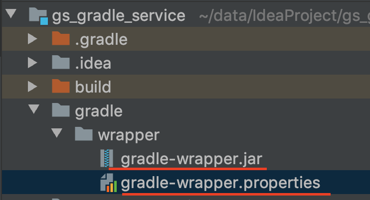

##### 1 Gradle 搭建项目
###### 1.1 项目创建
* IDEA 创建 Gradle Java 项目

 file -> new project -> Gradle -> 勾选 Java
输入: GroupId,ArtifactId,Version
* Gradle home

此处：使用了本地的gradle，以及映射为maven仓库

###### 1.2 配置脚本
创建完项目之后会自动生成 build.gradle , 在里面配置构建项目的基本脚本.
1.2.1 设置项目分组和版本号、引入java插件
```
// plugins 方法,传入闭包{} 作为参数
    plugins {
        id 'java'// java插件
    }
    group 'com.gsgradle.service'// 项目group
    version '1.1-SNAPSHOT' // 插件
    sourceCompatibility = 1.8 // Java版本号
```
1.2.2 声明依赖
 * 依赖的两种配置方式
```
     dependencies {
         implementation 'ch.qos.logback:logback-classic:1.2.2'
         testImplementation group: 'junit', name: 'junit', version: '4.12'
         compile 'org.springframework.boot:spring-boot-gradle-plugin:2.0.0.RELEASE'
     }
 ```
  * 使用dependencies 命令查看jar包依赖
 ```
 ./gradlew dependencies
 
 ```
1.2.3 指定maven仓库
 ```
 repositories {
             mavenLocal() // 本地
             maven { url 'http://maven.aliyun.com/nexus/content/groups/public/' } // 自定义地址
             mavenCentral() // maven中央仓库
         } 
```
###### 1.3 打包
gradle工具

因为gradle依赖jvm，所以gradle打包时会将build.gradle自动对应生成pom.xml文件


##### 2 gradle-wrapper
因为gradle版本更新比较快，所以使用wrapper对gradle进行版本管理，避免版本不匹配的问题。
* gradle中的wrapper目录

包含了gradle-wrapper.jar和gradle-wrapper.properties
** gradle-wrapper.jar 包含下载和解压gradle运行时的逻辑
** gradle-wrapper.properties 配置元信息，包含已下载gradle运行时的存储位置和原始url
* gradle-wrapper.properties
```
distributionBase=GRADLE_USER_HOME
distributionPath=wrapper/dists // 被解压缩后存放的相对路径
# 正式项目所用版本
distributionUrl=https\://services.gradle.org/distributions/gradle-5.6.4-all.zip
# 本地环境测试所用，免去下载
#distributionUrl=file:/Users/vista/data/gradle-5.6.4-all.zip
zipStoreBase=GRADLE_USER_HOME
zipStorePath=wrapper/dists
```
导入gradle项目时，不需提前为其配置gradle版本，gradle会加载gradle-wrapper.properties配置项，并为其自动下载对应的版本

