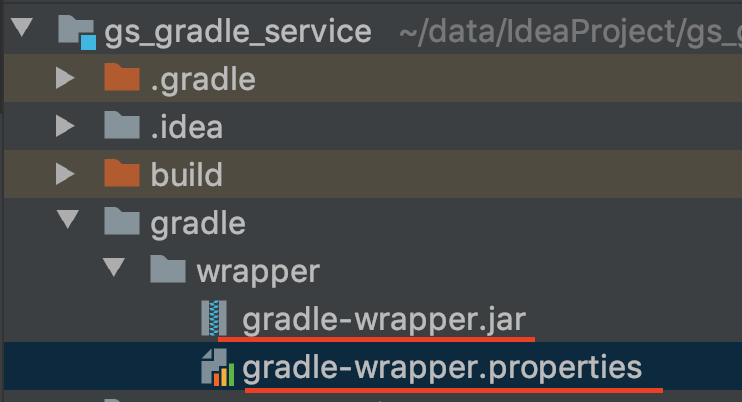

###### gradle-wrapper
因为gradle版本更新比较快，所以使用wrapper对gradle进行版本管理，避免版本不匹配的问题。
* gradle中的wrapper目录

* gradle-wrapper.properties
```
distributionBase=GRADLE_USER_HOME
distributionPath=wrapper/dists
# 正式项目所用版本
distributionUrl=https\://services.gradle.org/distributions/gradle-5.6.4-all.zip
# 本地环境测试所用，免去下载
#distributionUrl=file:/Users/vista/data/gradle-5.6.4-all.zip
zipStoreBase=GRADLE_USER_HOME
zipStorePath=wrapper/dists
```
导入gradle项目时，不需提前为其配置gradle版本，gradle会加载gradle-wrapper.properties配置项，并为其自动下载对应的版本

