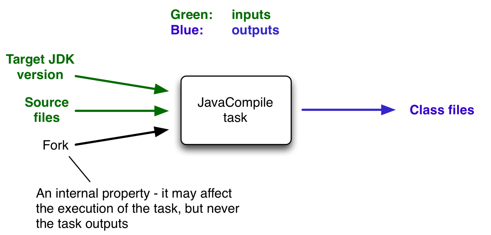

##### 引言
>官网：https://docs.gradle.org/5.6.4/userguide/more_about_tasks.html#sec:up_to_date_checks
###### up-to-date
当一个任务的输出没有变化时，任务编译时被标记为up-to-date。
任务的输出没有变化的情况：
* 任务有输入和输出，但他们都没有变化
* 任务有动作，但是任务告知gradle输出没有变化
* 任务没有动作和一些依赖，但是所有依赖都被标记为up-to-date，或者略过或者从cache中获取
* 任务没有动作并且没有任何依赖
###### 任务的输入和输出
任务接收一些输入并产生一些输出，在Java中源文件是输入，生成的class文件是输出，其他的输入可能包含是否包含调试信息等内容

上图中将jdk版本号及源文件记为任务的输入，编译后的class为任务输出；如果jdk的版本或源文件有任何的变动，则编译后的class文件必不同。所以当我们执行task编译时，gradle会自动检查task与上一次任务相比，输入或输出是否有改动，如果没有改动则将该task标记为up-to-date,直接从缓存中获取上一次的输出，跳过该task的编译。
* 任务最少有一个输出，否则gradle的增量构建不会生效
* memoryMaximumSize等运行参数，对编译文件结果没有影响，不作为task的输入。
* task中应该告诉gradle哪些是输入，哪些是输出：
1. 当任务属性影响输出时，将其标记为输入，否则任务将其标记为up-to-date；
2. 当任务属性不影响输出时，不要将其标记为输出，否则任务可能在不需要时执行。
3. 对于不确定的任务，诸如相同的输入会有不同的输出时，不应为其设置增量构建机制，因为up-to-date将不起作用。
首次编译及再编译

若在编译时不想使用up-to-date机制，强制执行task，执行命令添加：–rerun-tasks 参数
##### 将任务属性配置为输入输出
###### 自定义任务类型
自定义任务类型步骤：
* 通过getter方法，为每个任务的输入和输出定义属性类型
* 为这些属性添加注解
gradle支持三种输入和输出方式
- 简单类型
1. 诸如String和数字，通常情况下他们已经实现了Serializable
- 文件类型
1. 包括标准的File类型，还有Gradle的FileCollection类型的派生类，还有那些可以作为参数传递给Project.file(java.lang.Object)和Project.files(java.lang
.Object[])这两个方法的任意类型
- 内嵌类型
1.  内嵌类型不需要遵照其他两种类型，但是它有自己的输入输出属性，实际上任务的输入输出就内嵌在这些类型中。
更多注解详解请见官网

