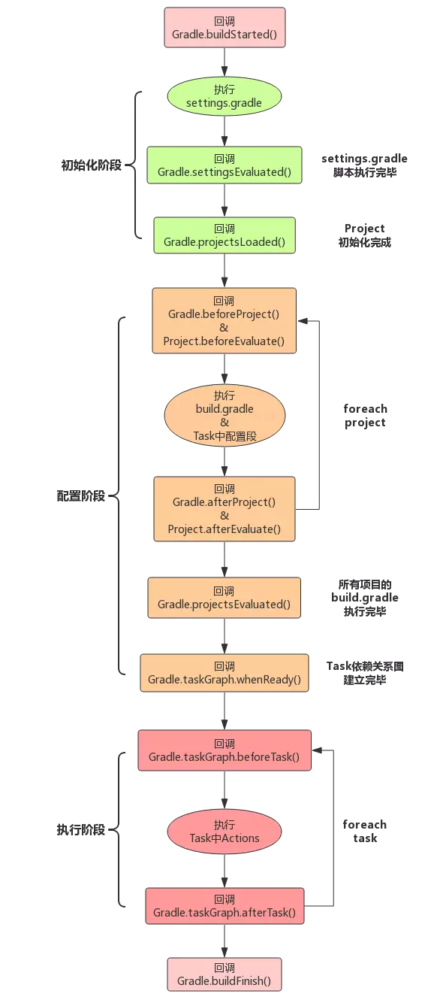

>https://www.wolfcode.cn/article/index/id/1370
官网：https://docs.gradle.org/current/userguide/build_lifecycle.html
https://www.jianshu.com/p/0acdb31eef2d

###### gradle生命周期
gradle构建分为三个阶段
* 初始化阶段
1. gradle支持单个或多个项目的构建，在初始化阶段，通过加载settings.gradle文件，判断哪些项目参与构建，并为每个项目创建一个project对象
```
rootProject.name = 'gs_gradle_service'
include 'gs_gradle_core','gs_gradle_model','gs_gradle_web','gs_gradle_admin'
```
* 配置阶段
1. 加载各项目下的 build.gradle 脚本，完成 project 的配置，并且构造 Task 任务依赖关系图以便在执行阶段按照依赖关系执行Task.执行task 中的配置代码

配置代码: 配置阶段就需要执行的代码,例如
```
task configCode{
println 'config Code'
}
```
* 执行阶段
1. 通过配置阶段的 Task 图,按顺序执行需要执行的 任务中的动作代码.

动作代码: 任务调用才会执行的代码.
```
task executeCode << {
doFirst{
println 'execute Code doFirst'
}
doLast{
println 'execute Code doLast'
}
}
```

###### Gradle Hook

上图表明了Gradle 构建的整个流程,在生命周期的三个阶段中有很多的钩子方法供用户自行覆盖使用.
注意:
1 初始化阶段的方法和 gradle.beforeProject() 只能定义在 setting.gradle 或 init.gradle 脚本中.
执行 build.gradle 时已经有了 project 对象.且执行前就调用了beforeProject方法.

2 gradle.buildStarted() 方法无法执行到.
通过源码得知,在初始化前就已经调用了 buildStarted 方法,所以在初始化阶段无法回调的到.

例子
setting.gradle
```
​// 初始化阶段
 gradle.settingsEvaluated {
     println "初始化阶段settingsEvaluated"
 }
 gradle.projectsLoaded {
     println "初始化阶段 projectsLoaded"
 /*    rootProject.buildscript {
         repositories {
         }
         dependencies {
         }
     }*/
 }
 
 // 配置阶段
 gradle.beforeProject {
     println "配置阶段 beforeProject"
 }
```
build.gradle
```task taskConfig {
       println 'taskConfig configuration'
       doLast {
           println 'taskConfig execute doLast'
       }
       doFirst {
           println 'taskConfig execute doFirst'
       }
   }
   
   gradle.afterProject {
       println '配置阶段 afterProject'
   }
   project.beforeEvaluate {
       println '配置阶段 beforeEvaluate'
   }
   gradle.projectsEvaluated {
       println '配置阶段 projectsEvaluated'
   }
   project.afterEvaluate {
       println '配置阶段 afterEvaluate'
   }
   gradle.taskGraph.whenReady {
       println '配置任务 whenReady'// 可以根据任务参数不同，执行不同的动作
   }
   // 执行阶段
   gradle.taskGraph.beforeTask {
       println "执行阶段 before task"
   }
   gradle.taskGraph.afterTask {
       println "执行阶段 afterTask "
   }
   gradle.buildFinished {
       println '构建结束 buildFinished'
   }
```
输出结果
```
 ./gradlew taskConfig
初始化阶段 settingsEvaluated
初始化阶段 projectsLoaded

> Configure project :
配置阶段 beforeProject
taskConfig configuration // 配置代码
配置阶段 afterProject
配置阶段 afterEvaluate
配置阶段 projectsEvaluated
配置任务 whenReady

> Task :taskConfig
执行阶段 before task
taskConfig execute doFirst// 动作代码
taskConfig execute doLast// 动作代码
执行阶段 afterTask 
构建结束 buildFinished
```
