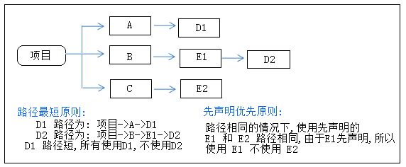

###### 引言

>以org.hibernate.hibernate-core中的org.slf4j版本冲突为例，org.hibernate.hibernate-core默认引用1.6.1版本
```
dependencies {
   compile group: 'org.hibernate', name: 'hibernate-core', version: '3.6.3.Final'
}
```

###### 1.maven版本冲突解决方式

对于 Maven 的自动处理传递性依赖版本冲突问题,是按最短路径和优先声明原则来处理.
Maven自动解决版本冲突原则

###### 2.gradle jar依赖

* 1.排除指定依赖jar包

```

dependencies {

        compile (group: 'org.hibernate', name: 'hibernate-core', version: '3.6.3.Final'){

                // module 是 jar 的 name,group是必选项，module可选

               exclude group:"org.slf4j" , module:"slf4j-api"  } }

```

* 2.排除所有依赖jar包

```

dependencies {

        compile (group: 'org.hibernate', name: 'hibernate-core', version: '3.6.3.Final'){

            // transitive默认为true ，设为false编译会报错，需要手动添加相应依赖jar包

            transitive=false   }}

```

###### 3.gradle 版本冲突解决方式

修改默认配置策略：

>(1) 最近版本策略（默认）

(2) 冲突失败策略：发生冲突时，编译失败（有些新版本库并不兼容之前的，因此这个库可以让开发者主动作出选择）

(3) 强制指定版本策略：发生冲突时，使用开发者指定的版本


* 1.版本优先策略：

gradle 自动引用最高版本的jar包

```

dependencies {
    compile group: 'org.slf4j',name: 'slf4j-api',version:'1.5.8'
    compile (group: 'org.hibernate', name: 'hibernate-core', version: '3.6.3.Final') {}
}
```


* 2.冲突失败策略

```

configurations.all{

    resolutionStrategy{

        //  gradle不处理版本冲突

        failOnVersionConflict()  }}

dependencies {
    compile group: 'org.slf4j',name: 'slf4j-api',version:'1.5.8'
    compile (group: 'org.hibernate', name: 'hibernate-core', version: '3.6.3.Final') {}
}
```

* 以上配置完,如果存在依赖 jar 包版本冲突问题, Gradle 将不再自动处理,build 会抛异常.

* 3.强制指定版本策略

```

configurations.all{

    resolutionStrategy{

        force 'org.slf4j:slf4j-api:1.7.24'  }}

```
###### 4.gradle 动态依赖jar包版本

```

dependencies {
           /* 选择最新的版本，避免直接指定版本号 */

    compile group: 'org.slf4j',name: 'slf4j-api',version:'latest.integration' }
```


 参考资料：

* https://www.cnblogs.com/gzdaijie/p/5296624.html

* https://www.wolfcode.cn/article/index/id/1600#