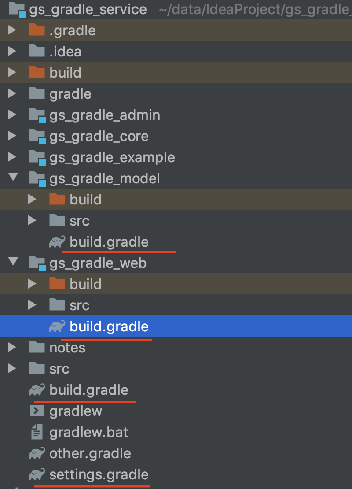

###### 1.项目构建图
```
Root project 'gs_gradle_service'
+--- Project ':gs_gradle_admin'
+--- Project ':gs_gradle_core'
+--- Project ':gs_gradle_model'
\--- Project ':gs_gradle_web'
```
###### 2.项目依赖关系
```
Root project 'gs_gradle_service'
+--- Project ':gs_gradle_admin'
        \--- Project ':gs_gradle_core'
            \--- Project ':gs_gradle_model'
+--- Project ':gs_gradle_core'
        \--- Project ':gs_gradle_model'
+--- Project ':gs_gradle_model'
\--- Project ':gs_gradle_web'
        \--- Project ':gs_gradle_core'
            \--- Project ':gs_gradle_model'
```
###### 3.项目目录

###### 项目配置
settings.gradle
```
rootProject.name = 'gs_gradle_service'
include 'gs_gradle_core', 'gs_gradle_model', 'gs_gradle_web', 'gs_gradle_admin'

```
* buildscript中的配置项仅对build.gradle生效
* allprojects中的配置项对所有项目生效
* subprojects中的配置项仅对子项目生效
```
buildscript {

    ext {
        springBootVersion = '2.0.0.RELEASE'
    }

    repositories {
        mavenCentral()
    }

    dependencies {
        classpath("org.springframework.boot:spring-boot-gradle-plugin:${springBootVersion}")
    }
}

allprojects {
    group 'com.gsgradle.service'
    version '1.1-SNAPSHOT'
}

subprojects {
    apply plugin: 'java'
    apply plugin: "io.spring.dependency-management"


    sourceCompatibility = 1.8

    tasks.withType(JavaCompile) {
        options.encoding = "UTF-8"
    }
// java编译的时候缺省状态下会因为中文字符而失败
    [compileJava, compileTestJava, javadoc]*.options*.encoding = 'UTF-8'

    repositories {
        mavenLocal()
        maven { url 'http://maven.aliyun.com/nexus/content/groups/public/' }
        mavenCentral()
    }

    dependencies {
        implementation 'ch.qos.logback:logback-classic:1.2.2'
        testImplementation group: 'junit', name: 'junit', version: '4.12'
        compile 'org.springframework.boot:spring-boot-gradle-plugin:2.0.0.RELEASE'
    }
}

```
* gs_gradle_web build.gradle
```
plugins {
    id 'war'
}

dependencies {
    compile project(":gs_gradle_core")
}
```
* gs_gradle_admin build.gradle
```
plugins {
    id 'war'
}
dependencies {
    compile project(":gs_gradle_core")
}
```

* gs_gradle_core build.gradle
```
dependencies {
    compile project(":gs_gradle_model")
    testImplementation group: 'junit', name: 'junit', version: '4.12'
}
```

* gs_gradle_model build.gradle
```
```
###### 扩展：
* settings文件介绍

项目路径是相对于根目录的项目目录，不是文件路径
如果更深层次的项目结构，使用：分隔每一个子项目的层次结构，例如：
想要映射model/todo/items目录结构，通过model:todo:items方式添加子项目

*声明跨项目依赖的task

 ** 默认task的执行顺序
 ```
#在根目录及子项目的build文件定义同名：task1
# 注：同项目中不能注册同名task，但项目之间可定义同名task，执行顺序为项目依赖关系
task task1 {
    doLast {
        println "group:${projectGroup}"
        println "version:${projectVersion}"

    }
}
#./gradlew task1
> Task :task1
group:com.gsgradle.service
version:1.0-SNAPSHOT

> Task :gs_gradle_example:task1
group:com.gsgradle.service
version:1.0-SNAPSHOT

```

 ** 控制task执行顺序
 ```
# 控制task的执行顺序
task task1(dependsOn: ':gs_gradle_example:task1') {
    doLast {
        println "group:${projectGroup}"
        println "version:${projectVersion}"

    }
}
#./gradlew task1

> Task :gs_gradle_example:task1
group:com.gsgradle.service
version:1.0-SNAPSHOT

> Task :task1
group:com.gsgradle.service
version:1.0-SNAPSHOT

```
* maven pom文件转换为gradle
1.gradle读取已有的setting.xml文件内容
2.将maven的pom.xml转化为gradle的配置文件 maven2Gradle
* 在已建好的maven项目下执行：gradle init --type pom
* 如果在新建的gradle项目中复制pom.xml文件，执行上述命令前必须新建好项目的子项目文件夹，否则执行报错

3.比较构建
包含gradle的升级