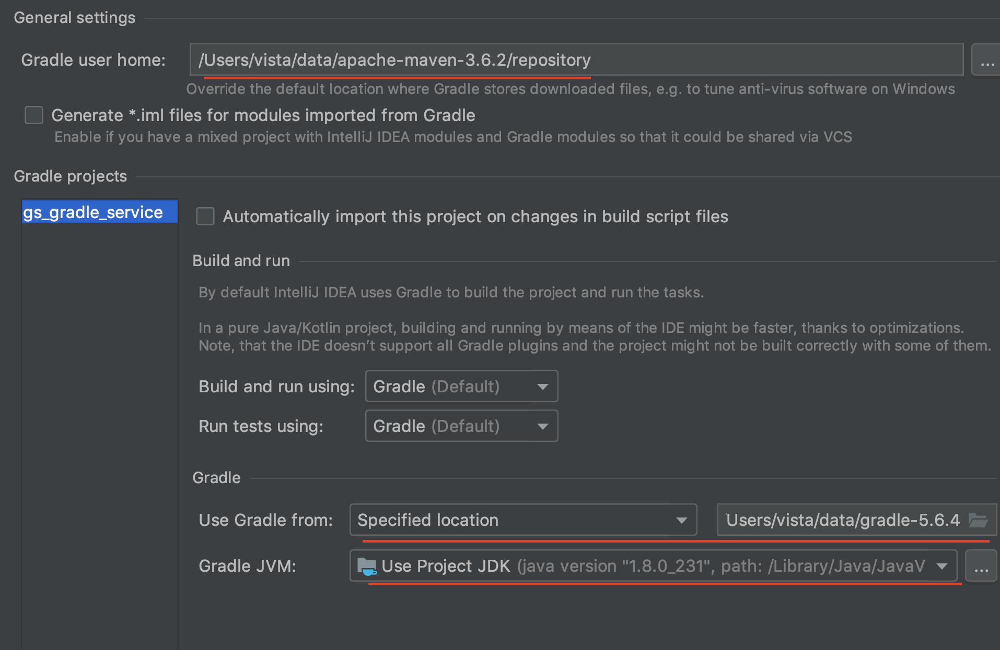
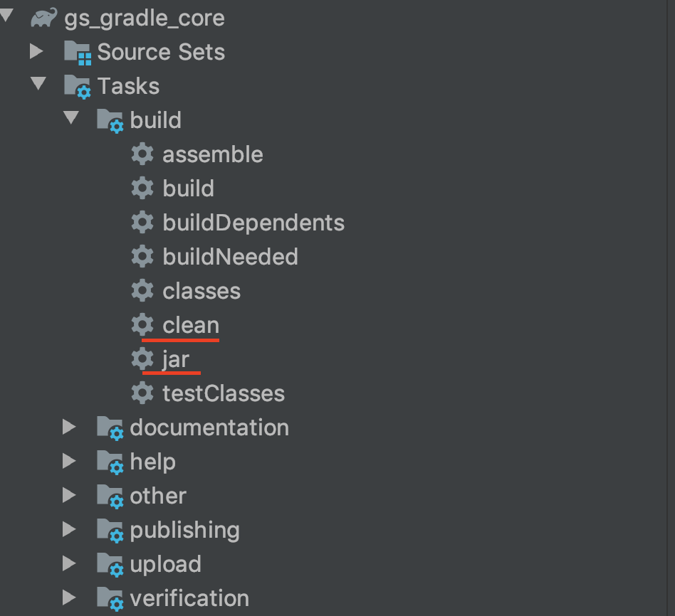
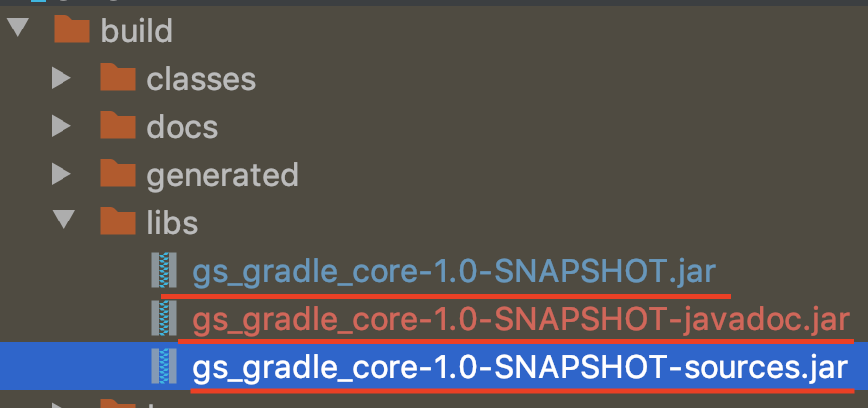

##### 1 Gradle 搭建Java项目
使用构建工具搭建 Java 项目的主要目的就是其自动的打包和依赖功能.以下就来看下如何使用 Gradle 搭建 Java 项目

###### 1.1 项目创建
IDEA 自带 Gradle 和 Groovy 插件,所以可以直接创建 Gradle 项目.如果是 eclipse 需要安装对应的插件.

IDEA 创建 Gradle Java 项目

* file -> new project -> Gradle -> 勾选 Java
输入: GroupId,ArtifactId,Version
* Gradle home

此处：使用了本地的gradle，以及映射为maven仓库

###### 1.2 配置脚本
build.gradle 
```
// plugins 方法,传入闭包{} 作为参数
    plugins {
        id 'java'// java插件
    }
    group 'com.gsgradle.service'// 项目group
    version '1.1-SNAPSHOT' // 插件
    sourceCompatibility = 1.8 // Java版本号
// repositories 方法,配置仓库地址
    repositories {
        mavenCentral()
    }
// dependencies 方法,配置依赖jar
    dependencies {
        testCompile group: 'junit', name: 'junit', version: '4.12'
    }
```
创建完项目之后会自动生成 build.gralde , 里面配置了构建项目的基本脚本.
###### 1.3 打包
gradle工具

因为gradle依赖jvm，所以gradle打包时会将build.gradle自动对应生成pom.xml文件

