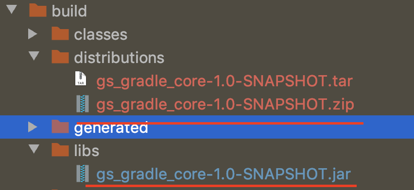
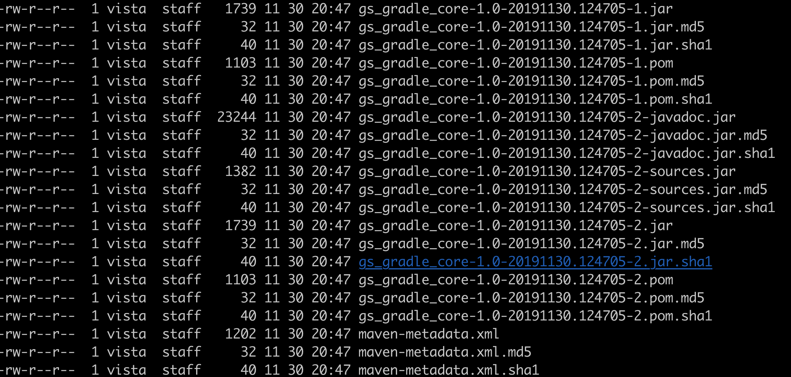

###### 1.定义附加包
archives配置项定义了项目的输出包，Java项目默认的输出包为jar文件，当执行assemble task的时候，所有定义的包都被构建出来。但有时需要添加更多的输出包来丰富插件项目。
* 输出JavaJar和JavaDocs
```

task sourcesJar(type: Jar) {
    from sourceSets.main.allJava // 创建包含所有源文件的jar包的task
    classifier  'sources' // Java jar文件加source后缀
}

task javadocJar(type: Jar,dependsOn:javadoc) {
    from javadoc  // 创建包含JavaDoc的jar包的task
    classifier  'javadoc' // Java doc文件加javadoc后缀
}

artifacts { // 通过制定archives配置来注册附件包
    archives sourcesJar 
    archives javadocJar
}
// 添加sourcesJar,javadocJar作为task打包依赖
assemble.dependsOn sourcesJar,javadocJar

// idea中执行assemble命令
> Task :gs_gradle_core:compileJava UP-TO-DATE
> Task :gs_gradle_core:processResources NO-SOURCE
> Task :gs_gradle_core:classes UP-TO-DATE
> Task :gs_gradle_core:jar UP-TO-DATE  //标准的jar task
> Task :gs_gradle_core:javadoc UP-TO-DATE
> Task :gs_gradle_core:javadocJar UP-TO-DATE // jar task打包了项目的javadocs 
> Task :gs_gradle_core:sourcesJar UP-TO-DATE // jar task绑定了项目的源代码
> Task :gs_gradle_core:assemble UP-TO-DATE

```
libs 下目录
* jar：包含文件和基础数据的标准jar文件
* sources:生成的源代码jar文件
* javadoc:生成的javadoc jar文件


###### 2.创建分发包
distribution插件提供了更简洁的分发包方式，无需手动的设置包名
```
apply plugin: 'distribution'

distributions {
    main { // 标准分发包配置闭包默认名为main
    baseName="" // 分发文件的基础名字
        contents {
            from {
                libsDir //打包 build/libs目录下的所有文件 
            }
        }
    }
}
// 打包
// gradle assemble distZip

```
*  distZip： 生成zip包
*  distTar：生成tar包
分发包被放置在build/distribution目录下


###### 3.配置自定义的分发包
```

task sourcesJar(type: Jar) {
    from sourceSets.main.allJava
    classifier  'sources'
}

task javadocJar(type: Jar,dependsOn:javadoc) {
    from javadoc
    classifier  'javadoc'
}

artifacts {
    archives sourcesJar
    archives javadocJar
}
distributions {
    main {
    }
    docs{// 自定义的分发配置闭包
        contents {
            from (libsDir){ // 只打包build/libs下面的源代码和javadocs jar文件
                include sourcesJar.archiveName
                include javadocJar.archiveName
            }
        }
    }
}
// 使用docsDistZip和docsDistTar生成文档分发包(为何执行zip出现 zip+tar??)
//  gradle assemble docsDistTar
```


###### 4.发布jar组件到maven
build.gradle
```
apply plugin :'maven-publish'

publishing{
    publications{

        plugins(MavenPublication){ // 定义mavenPublication类型的发布包名字

            from components.java //添加jar组件到发布包列表

            artifactId 'cloudbees-plugin' // 声明发布包id
        }
    }
}
// idea中执行publish命令，输出如下：
> Task :gs_gradle_core:compileJava UP-TO-DATE
> Task :gs_gradle_core:processResources NO-SOURCE
> Task :gs_gradle_core:classes UP-TO-DATE
> Task :gs_gradle_core:jar UP-TO-DATE
> Task :gs_gradle_core:publishMavenPublicationToMavenRepository
> Task :gs_gradle_core:generatePomFileForPluginsPublication
> Task :gs_gradle_core:publishPluginsPublicationToMavenRepository
> Task :gs_gradle_core:publish

// ./gradlew tasks 
//查看tasks列表，因为没有配置maven地址，所以会发布到$user_home/repository目录下的maven本地缓存
Publishing tasks
----------------
generateMetadataFileForMavenPublication - Generates the Gradle metadata file for publication 'maven'.
generateMetadataFileForPluginsPublication - Generates the Gradle metadata file for publication 'plugins'.
generatePomFileForMavenPublication - Generates the Maven POM file for publication 'maven'.
generatePomFileForPluginsPublication - Generates the Maven POM file for publication 'plugins'.
// 发布项目中所有的包
publish - Publishes all publications produced by this project.
publishAllPublicationsToMavenRepository - Publishes all Maven publications produced by this project to the maven repository.
publishMavenPublicationToMavenLocal - Publishes Maven publication 'maven' to the local Maven repository.
publishMavenPublicationToMavenRepository - Publishes Maven publication 'maven' to Maven repository 'maven'.
// 只发布软件组件到本地maven缓存中
publishPluginsPublicationToMavenLocal - Publishes Maven publication 'plugins' to the local Maven repository.
publishPluginsPublicationToMavenRepository - Publishes Maven publication 'plugins' to Maven repository 'maven'.
// 发布指定的包到本地maven缓存
publishToMavenLocal - Publishes all Maven publications produced by this project to the local Maven cache.

```
###### 5.声明自定义的发布包

```
// 配置libs
task sourcesJar(type: Jar) {
    from sourceSets.main.allJava
    classifier  'sources'
}

task javadocJar(type: Jar,dependsOn:javadoc) {
    from javadoc
    classifier  'javadoc'
}

artifacts {
    archives sourcesJar
    archives javadocJar
}
// 自定义发布
publishing {
    publications {
        plugins(MavenPublication) {
            from components.java // 添加项目的jar组件到发布列表
          //  artifactId 'cloudbees-plugin'
            artifact sourcesJar // 添加自定义包到发布列表
            artifact javadocJar
        }
    }
}
// 执行idea中的publish命令
```
mavenLocal显示


###### 7.修改pom文件
生成的标准pom文件可以通过pom.withXml来修改，通过调用asNode()方法，遍历pom文件的根节点，可以添加新的节点和修改已有的节点

###### 6.发布到本地的maven仓库
将想要发布的目标仓库放在repositories配置块中定义。
```
apply plugin :'maven-publish'

publishing {
    publications {
        plugins(MavenPublication) {
            from components.java
            artifact sourcesJar
            artifact javadocJar
        }
    }
    repositories {
        maven {
            name 'myLocalhost' //maven仓库可选名字
            url "file://Users/vista/data/repository/repo"// 本地maven仓库的文件url
        }
    }
}

```
仓库名称是可选的，如果你指定了名字就会生成对应的发布的task名字的一部分。比如指定名字为myLocalhost，idea的publish中task
会自动publishPluginPublicationToMyLocalhostRepostory。在同时处理多个仓库的时候该功能非常有用


###### 7.发布到远程的maven仓库
远程仓库需要有artifactory实例，并且可以通过http(s)进行访问。
artifactory默认预配置两个maven仓库：
** libs-snapshot-local:用于发布还处于开发阶段的包，会加上-SNAPSHOT后缀
** libs-release-local：用于发布已经成型的包，将会去掉-SNAPSHOT后缀
 1.首先在其他.gradle文件中配置管理员认证信息
 artifactoryusername=admin
 artifactoryPassword=password
 2.编写发布脚本

```
ext {
// 定义artifactory仓库url的属性
    baseUrl = "http://locahost:8081/artifactory"
    snapshotUrl = "$baseUrl/libs-snapshot-local"
    releaseUrl = "$baseUrl/libs-release-local"
}

publishing {
    publications {
        plugins(MavenPublication) {
            from components.java
            artifact sourcesJar
            artifact javadocJar
        }
    }
    repositories {
        maven {
            name 'remoteArtifactory' //maven仓库可选名称
            url project.version.endsWith('-SNAOSHOT') ? snapshotUrl : releaseUrl //根据项目版本选择快照或发布仓库
            credentials{
                username=artifactoryusername //设置上传凭证信息
                password=artifactoryPassword
            }
        }
    }
}
```

###### 8.发布到公共的二进制仓库
此处不再叙述


