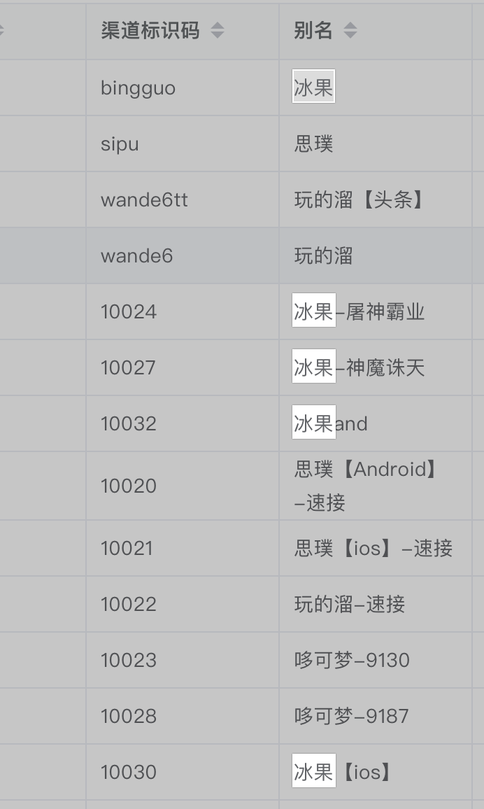

#groovy 闭包

#1.样式
// 参数 参数类型可选，仅有一个参数可直接使用 it
{[closureParameters->] statements}
#2.示例
{item++}
// 即使省略->，闭包的隐式参数it总是存在，除非显式的在参数列表上什么都不指定
{->item++} // 显式指定闭包没有参数
{println it}
{it->println it}
{name->println name}
{String x,int y-> println "hey ${x} the value is ${y}"}
{reader->
        def line =reader.readLine()
        line.trim()
}
{String... args-> args.join('')}// 可变参数
#3.使用
// 可以将闭包赋值给变量，然后将变量作为函数来调用；或者使用闭包的call方法调用闭包
def fun={println "$it"}
fun(1234)

Closure date={println localDate.now()}
date.call()

Closure<LocalTime> time={LocalTime.mow()}
println "now is ${time()}"

/Users/vista/data/IdeaProject/v_java_gradle/notes/picture/屏幕快照 2019-11-11 下午3.05.25.png

